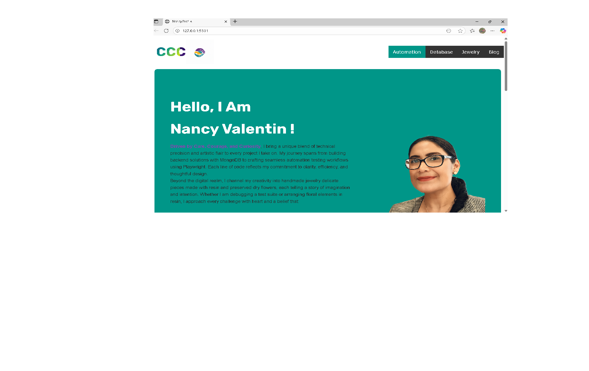
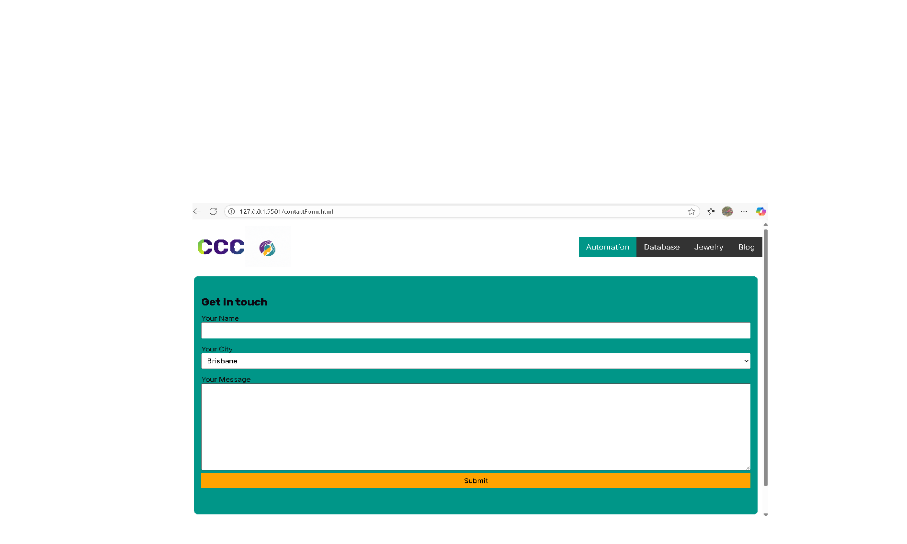
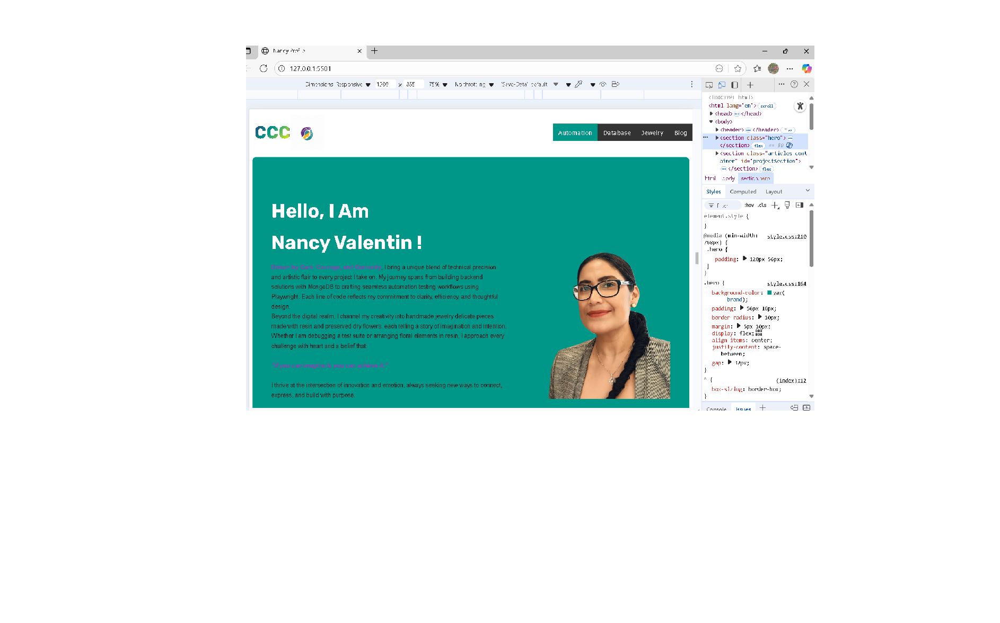
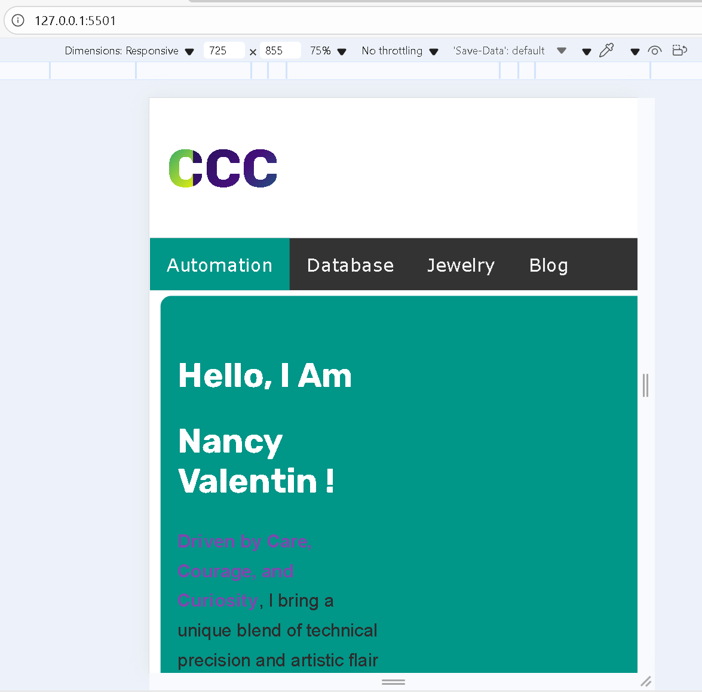
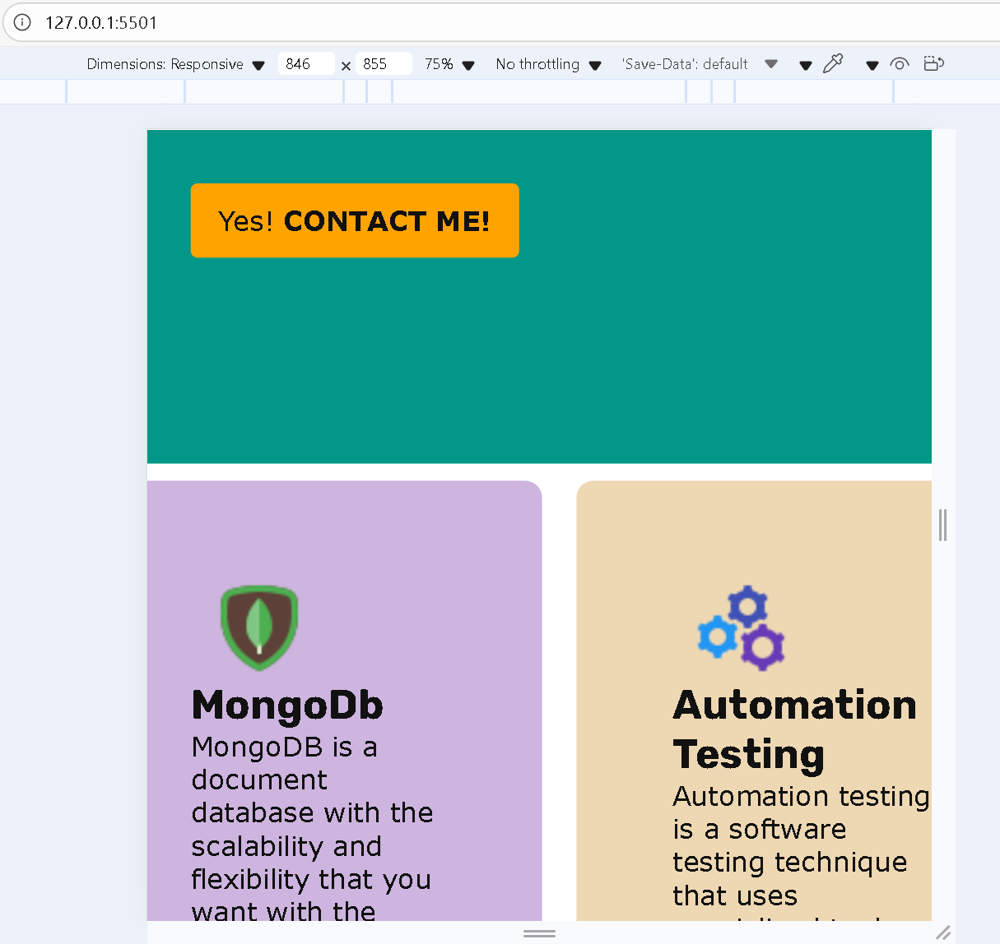
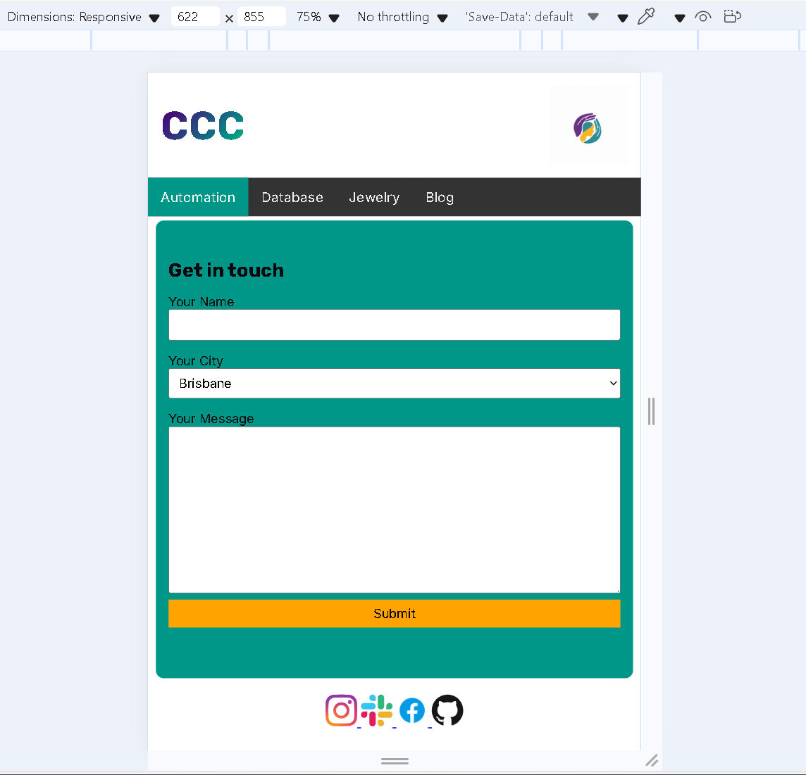
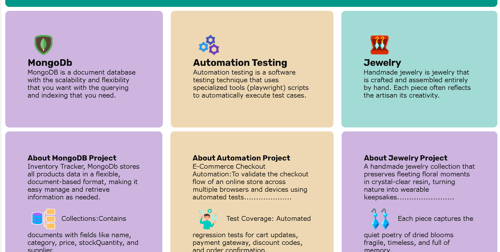
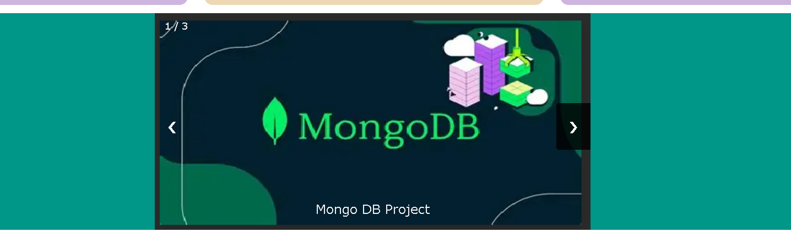

#  your_name_here - Portfolio Task
​
[My portfolio site](https://nancyvale.github.io/)
​
## Project Requirements

### Content
 Add a short paragraph describing the features below. What aesthetic and technical choices did you make? 
- [ ] At least one profile picture: I added my photo using img from HTML and css.
- [ ] Biography (at least 100 words): It is related to my projects.
- [ ] Functional Contact Form: I have used a form in HTML. 
- [ ] "Projects" section: I have 3 Projects MongoDb Project, Automation Project and Jewelry Project.
- [ ] Links to external sites, e.g. GitHub and LinkedIn: I have use my github link (https://github.com/NancyVale/).
​
### Technical
 Add a short paragraph describing the features below. What strategies or design decisions did you work from? 
- [ ] At least 2 web pages: I have created a button that links to my second page that it is my contact form 
- [ ] Version controlled with Git: I have created 1 branch and push several times to that branch then I marge to main.
- [ ] Deployed on GitHub pages: I have pushed my feature branch to main branch.
- [ ] Implements responsive design principles: I used media queries and Flexbox to make the design responsive.
- [ ] Uses semantic HTML: I have used articles,sections,header and footer

### Bonus (optional)
 Add a short paragraph describing the features below, if you included any. 
- [ ] Different styles for active, hover and focus states: I have use CSS
- [ ] Include JavaScript to add some dynamic elements to your site: Yes, I’ve added some JavaScript to create an image carousel and changing my logo colors.
​
### Screenshots
> Please include the following:
> - The different pages and features of your website on mobile, tablet and desktop screen sizes (multiple screenshots per page and screen size).

> - The different features of your site, e.g. if you have hover states, take a screenshot that shows that.  
> 

> You can do this by saving the images in a folder in your repo, and including them in your readme document with the following Markdown code: 

####  image_title_goes_here 

